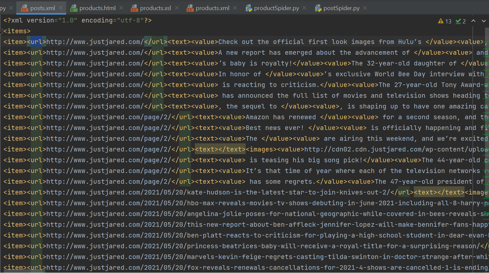
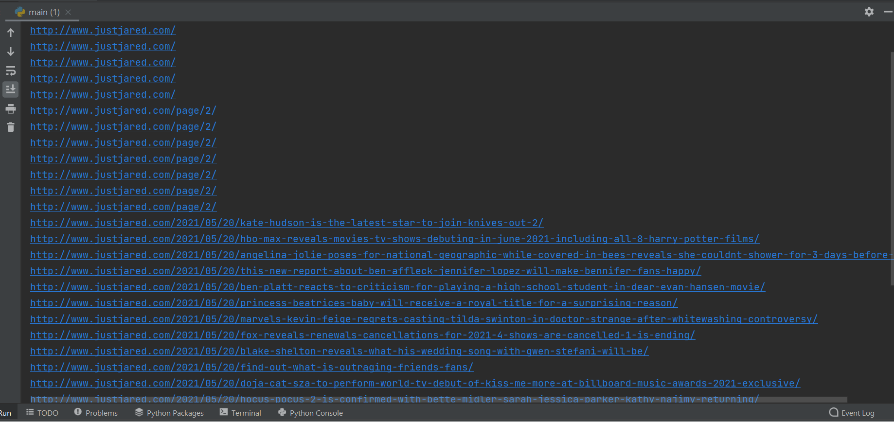
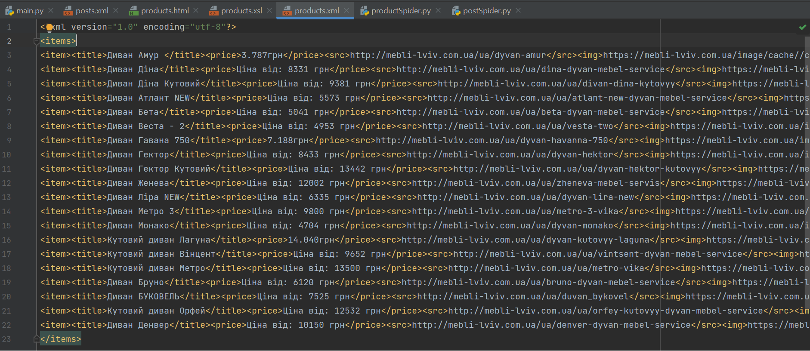
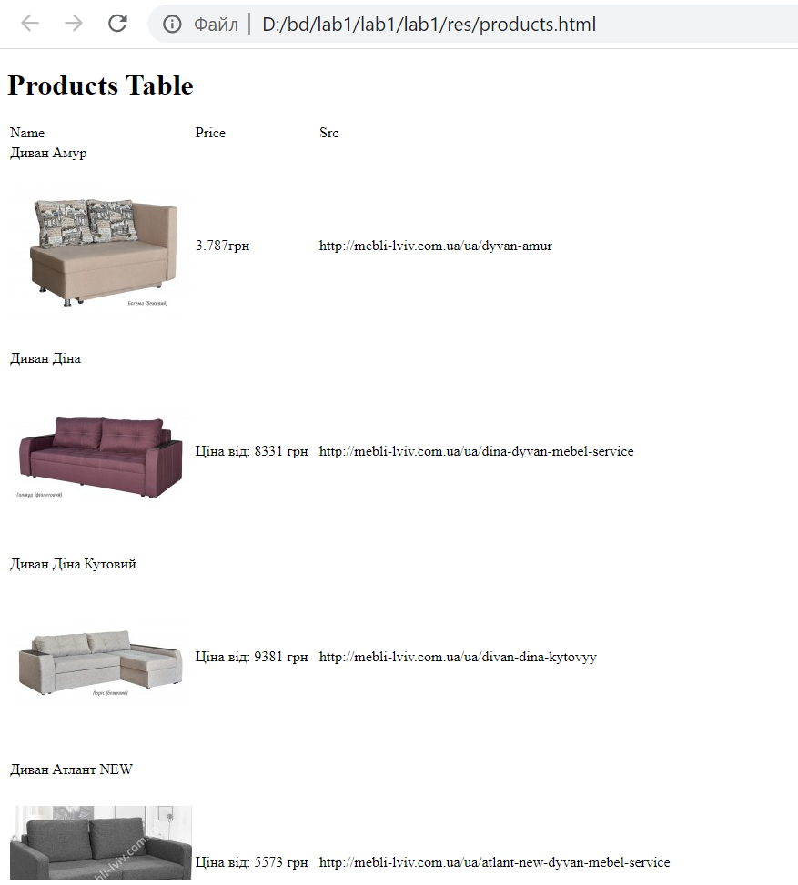

# Лабораторна робота No 1.
## Вивчення базових операцій обробки XML-документів
Метою роботи є здобуття практичних навичок створення програм, орієнтованих на обробку XML-документів засобами мови Python.

Варіант №14

Завдання роботи полягає у наступному:
1. Виконати збір інформації зі сторінок Web-сайту за варіантом.
2. Виконати аналіз сторінок Web-сайту для подальшої обробки текстової та графічної інформації, розміщеної на ньому.
3. Реалізувати функціональні можливості згідно вимог, наведених нижче.

### Завдання №1
На основі базової адреси Web-сайту виконати обхід наявних сторінок сайту, відокремлюючи текстову та графічну інформацію від тегів HTML.  Пошук вузлів виконувати засобами XPath. Наступну сторінку для аналізу цього ж сайту обрати як одне із гіперпосилань на даній сторінці. Обмежитись аналізом 20 сторінок сайту. Зберегти XML у вигляді файлу.

Для першого завдання було обрано інший сайт, а саме: http://www.justjared.com/

Скріншот файлу результату:

### Завдання №2
Виконати аналіз отриманих даних засобами XML згідно варіанту та вивести результати у консольне вікно. Відбір вузлів та розрахунки за варіантом виконувати засобами XPath.

Скріншот файлу результату:

### Завдання №3
Проаналізувати вміст Web-сторінок інтернет-магазину (див. варіант). Отримати ціну, опис та зображення для 20 товарів з нього за допомогою DOM-парсеру та мови XPath для пошуку відповідних вузлів. Результат записати в XML-файл.

Скріншот файлу результату:

### Завдання №4
Перетворити отриманий XML-файл у XHTML-сторінку за допомогою мови XSLT. Дані подати у вигляді XHTML-таблиці та записати його у файл.

Скріншот файлу результату:

